# JiraTicketStats

JiraTicketStats is small tool to evaluate Jira tickets.

## Usage

As input, a Jira Filter CSV export is used. An example Jira query is:

``` jira
project = "XXX" and component = XXX and (resolutiondate is EMPTY or resolutiondate >= startOfDay(-365))
```

This query can be exported as CVS, separated by Semicolons, and used as input
for this tool. To generate the report, run:

``` bash
jiraticketstats -csv <path to your export>
```

JiraTicketStats supports the following parameters:

- csv: Path to the Jira export.
- jira: Jira base URL to generate links. This URL + issue key should be valid.
- project: Jira project key to filter the issue set.
- component: Component name to filter the issue set.
- splitByComponent: Generate a report for each components of the issue set.

## Example

The file `exmple.data` contains some example issues. You can generate a example
test record with the command:

``` bash
go run . -csv example.data
```

## Report

The output of JiraTicketStats is an HTML report containing the following sections:

- Old bug tickets
- Bug tickets
- Features
- Improvements
- Other tickets
- Resources
- Warnings

### Old bug tickets

The old bug tickets section consists of a table listing all bug tickets older
than 30 days. For each ticket the following data is displayed:

- Issue: Jira ticket key and summary. The key is a link to the ticket in Jira.
- Age: The age of the tickets as days, calculated using the Jira creation date.
- Labels: All labels assigned to the ticket.
- Status: The current status of the ticket.
- Creator: The user name of the Jira user who created the ticket.
- Assignee: The user name of the Jira user who is assigned to the ticket.

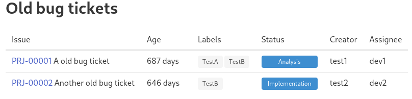

### Bug tickets

The bug tickets section consists of three parts showing different bug ticket
evaluations.

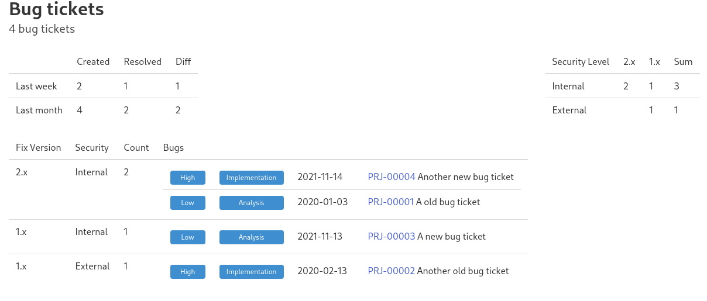

The first block show the change of ticket count in the last week and the last
month. The "created" value is the sum of all bug tickets with a created date
in the last week or month. The "resolved" value is the sum of all bug tickets
with a resolved date in the last week or month. The "diff" is the difference
between the two values, i.e. the change in the bug count.

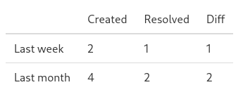

The second block is a matrix listing the ticket number for each fix version and
security level combination and a sum of the tickets for each security level.

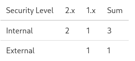

The third block is a table of all tickets grouped by fix version and security
level. For each ticket the priority, the status, the created date, the key and
the summary is displayed.

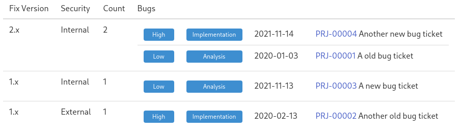

### Features

// TODO: fill

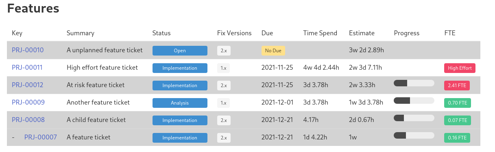

### Improvements

// TODO: fill

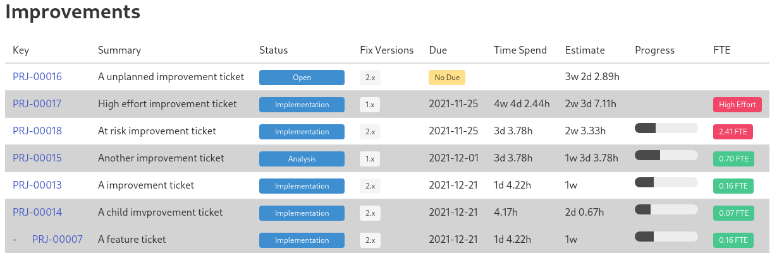

### Other tickets

// TODO: fill

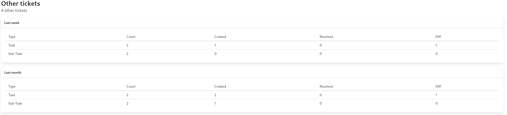


### Resources

// TODO: fill

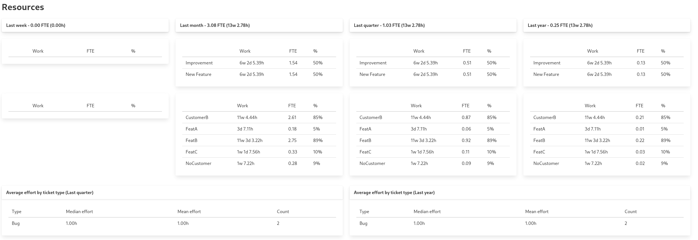

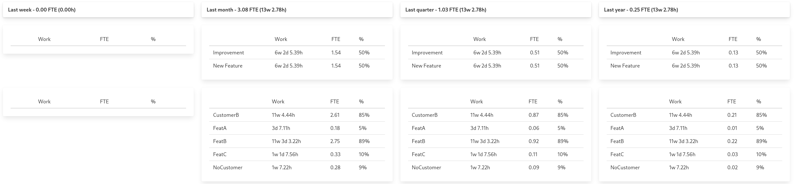

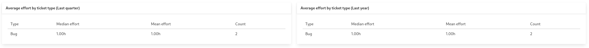

### Warnings

// TODO: fill

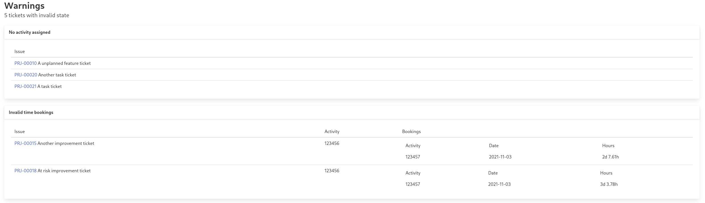

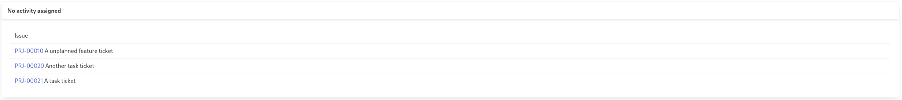

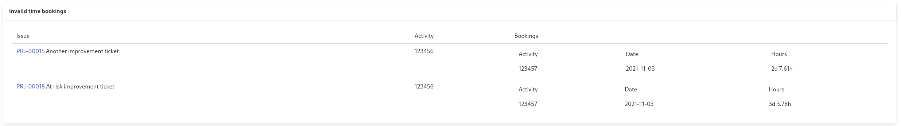

## Config

JiraTicketStats supports a configuration of different formats and external
constants, e.g. ticket names. These values are internally stored in a config
structure implemented in `config.go`. When the tool is executed, a file
`config.json` is read form the current working directory. If this file doesn't
exist it is created using default values.

## Architecture

JiraTicketStats is implemented using the package `ticketstats` and split in different
Go files, grouping logical sections.

### Config

JiraTicketStats is using Config data structures which groups different values,
mostly strings, required during the processing steps and configured in Jira,
e.g. type and state names. This is implemented in `config.go`.

### Data

It using two types of data models, one for evaluation implemented in `issue.go`,
and one for rendering, implemented in `render.go`.

#### Parsing the data

JiraTicketStats reads the following field from the Jira export to the evaluation
data type:

- "Summary -> issue.Summary (string)
- Issue key -> issue.Key (string)
- Issue id -> issue.Id (string)
- Parent id -> issue.Parent (string)
- Issue Type -> issue.Type (string)
- Status -> issue.Status (string)
- Priority -> issue.Priority (string)
- Assignee -> issue.Assignee (string)
- Creator -> issue.Creator  (string)
- Created -> issue.Created (time.Time)
- Updated -> issue.Updated (time.Time)
- Last Viewed -> issue.LastViewed (time.Time)
- Affects Version/s -> issue.AffectsVersions ([]string)
- Fix Version/s -> issue.FixVersions ([]string)
- Component/s -> issue.Components ([]string)
- Log Work -> issue.LogWorks ([]WorkLog)
- Original Estimate -> issue.OriginalEstimate (Work)
- Remaining Estimate -> issue.RemainingEstimate (Work)
- Time Spent -> issue.TimeSpend (Work)
- Σ Original Estimate -> issue.SumOriginalEstimate (Work)
- Σ Remaining Estimate -> issue.SumRemainingEstimate (Work)
- Σ Time Spent -> issue.SumTimeSpend (Work)
- Security Level -> issue.SecurityLevel (string)
- Labels -> issue.Labels ([]string)
- Resolution -> issue.Resolution (string)
- Resolved -> issue.Resolved (time.Time)
- Due Date -> issue.Due (time.Time)
- Outward issue link (Blocks) -> issue.LinkBlocks ([]string)
- Outward issue link (Causes) -> issue.LinkCauses ([]string)
- Outward issue link (Cloners)-> issue.LinkCloners ([]string)
- Outward issue link (Dependency) -> issue.LinkDependencies ([]string)
- Outward issue link (Duplicate) -> issue.LinkDuplicates ([]string)
- Outward issue link (Issue split)-> issue.LinkIssueSplits ([]string)
- Outward issue link (Part) -> issue.LinkParts ([]string)
- Outward issue link (Relates) -> issue.LinkRelates ([]string)
- Outward issue link (Relation)-> issue.LinkRelations ([]string)
- Outward issue link (Triggers) -> issue.LinkTriggers ([]string)
- Outward issue link (linkIssue)-> issue.LinkLinkIssues ([]string)
- Outward issue link (parent) -> issue.LinkParents ([]string)
- config.Customs.ExternalId -> issue.CustomExternalId (string)
- config.Customs.SupplierReference -> issue.CustomSupplierRef (string)
- config.Customs.Variant -> issue.CustomVariant (string)
- config.Customs.Account -> issue.CustomActivity (string)
- config.Customs.Category -> issue.CustomCategory (string)

The implementation can be found `issue.go`.

#### Type WorkLog

The type 'WorkLog' is defined in `issue.go` and splits the Jira 'Log Work' data
into teh fields:

- Hours (Work)
- Date (time.Time)
- Activity (string)

#### Type Work

The type Work is used to represent work hours. It is just a float64 with the
unit work hours, not seconds as used by Jira.

#### Generating the report

// TODO: describe report data structures

### Processing

// TODO: write
